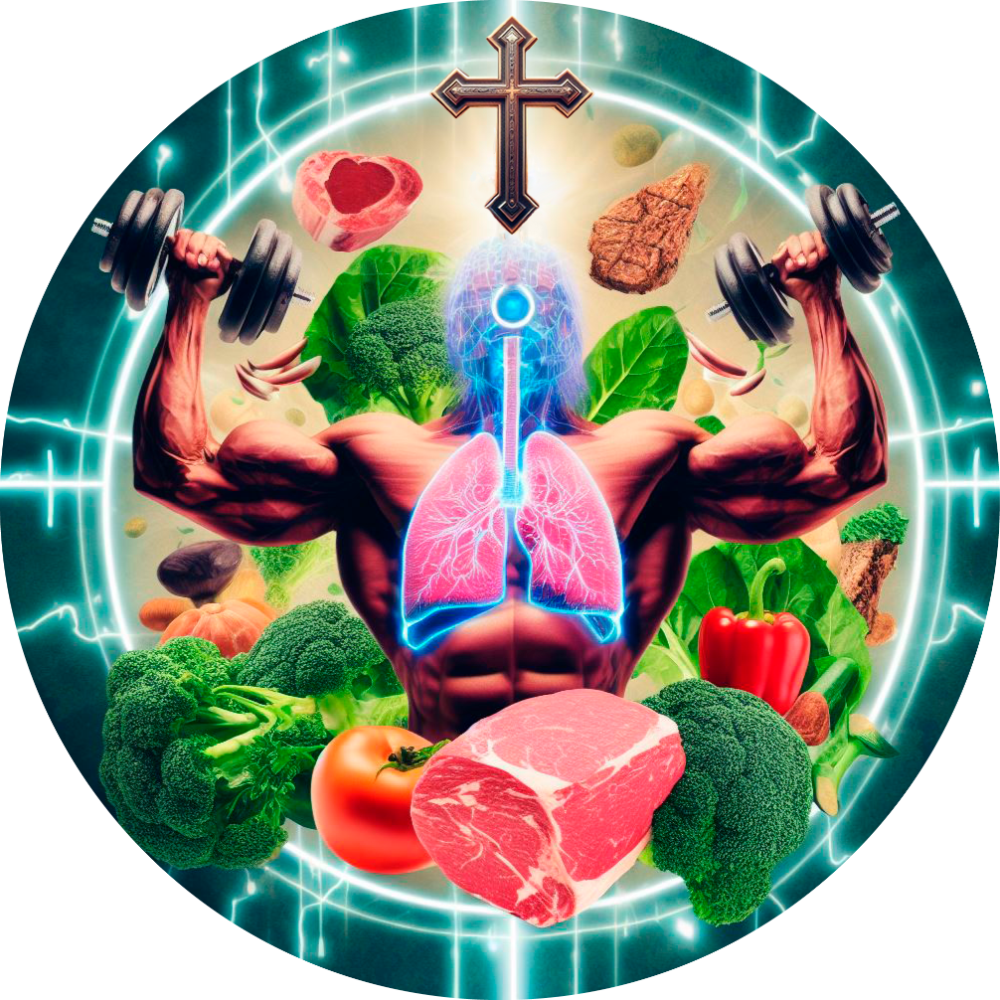

<h1 align="center">:construction: Projeto em Desenvolvimento :construction:</h1>

# MacrosMastery(backend)

<fig>

</fig>

## Objetivo
O MacrosMastery é um projeto em desenvolvimento que tem como objetivo fornecer uma plataforma online para cálculo de macros de dieta flexível, acompanhamento de progresso e compartilhamento de informações relacionadas à nutrição.

## Status do Projeto
O MacrosMastery ainda está em fase de desenvolvimento ativo. Durante essa fase, estamos trabalhando na implementação das principais funcionalidades e aprimorando a interface do usuário. Esse repositório é dedicado ao backend da aplicação.

## Funcionalidades Planejadas
O projeto MacrosMastery está sendo desenvolvido com as seguintes funcionalidades planejadas:

- Cálculo de macros personalizados: Os usuários poderão inserir suas informações pessoais, como peso, altura, idade, nível de atividade física, objetivos de fitness, e o sistema fornecerá recomendações de macros personalizadas para atingir esses objetivos.

- Acompanhamento de progresso: Os usuários poderão registrar seu peso, medidas corporais e outras métricas de progresso. O MacrosMastery exibirá o histórico para acompanhar a evolução dos usuários ao longo do tempo.

- Posts educativos: O MacrosMastery contará com uma seção de blog, onde serão publicados artigos informativos sobre nutrição, alimentos, índice glicêmico e outros tópicos relevantes para uma dieta flexível.

## Contribuição
Neste momento, não estamos aceitando contribuições externas, uma vez que o projeto está em desenvolvimento ativo. No entanto, fique à vontade para acompanhar o progresso do projeto e fornecer feedback.

## Tecnologias Inicialmente Utilizadas

[![typescript][typescript-card]][typescript-url]
[![node.js][Node.js-card]][Node.js-url]
[![docker][docker-card]][Docker-url]
[![express][express-card]][express-url]
[![sequelize][sequelize-card]][sequelize-url]
[![mysql][mysql-card]][mysql-url]

 

    
<h2>:warning: **AVISO LEGAL** :warning:</h2>
<br /

  - Este projeto foi desenvolvido por um entusiasta amador da área da nutrição e não substitui o aconselhamento profissional de médicos ou nutricionistas. As informações fornecidas pelo projeto são apenas para fins educacionais e de referência geral.
  - É importante ressaltar que cada pessoa é única e tem necessidades nutricionais individuais. O cálculo de macros e qualquer outra informação fornecida pelo projeto podem não ser adequados ou precisos para todas as pessoas.
  - Recomendamos fortemente que você consulte um profissional de saúde qualificado, como um médico ou nutricionista, antes de fazer mudanças significativas em sua dieta ou seguir as informações fornecidas pelo projeto. Eles poderão avaliar sua saúde, necessidades específicas e fornecer orientações personalizadas.
  - O autor deste projeto não assume nenhuma responsabilidade por quaisquer danos ou consequências causados pelo uso das informações fornecidas pelo projeto. O uso deste projeto é de total responsabilidade do usuário.

  

[node.js-card]: https://img.shields.io/badge/-Node.js-80BC02?style=for-the-badge&logo=node.js&logoColor=black
[node.js-url]: https://nodejs.org/en

[typescript-card]: https://img.shields.io/badge/-typescript-3178C6?style=for-the-badge&logo=typescript&logoColor=black
[typescript-url]: https://www.typescriptlang.org/

[docker-card]: https://img.shields.io/badge/-docker-2496ED?style=for-the-badge&logo=docker&logoColor=black
[docker-url]: https://www.docker.com/

[mysql-card]: https://img.shields.io/badge/-mysql-4479A1?style=for-the-badge&logo=mysql&logoColor=black
[mysql-url]: https://www.mysql.com/

[express-card]: https://img.shields.io/badge/-express-000000?style=for-the-badge&logo=express&logoColor=black
[express-url]: https://expressjs.com/

[sequelize-card]: https://img.shields.io/badge/-sequelize-52B0E7?style=for-the-badge&logo=sequelize&logoColor=black
[sequelize-url]: https://sequelize.org/
